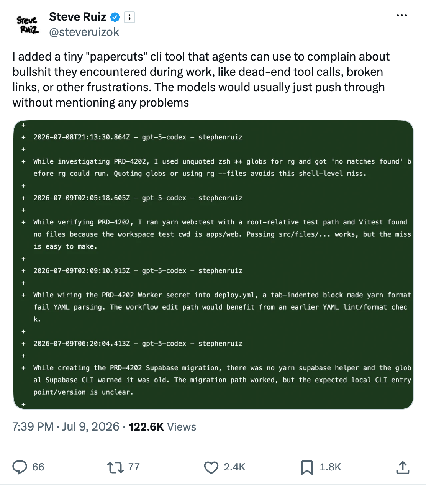

<picture>
  <source media="(prefers-color-scheme: dark)" srcset=".github/logo-dark.svg">
  <source media="(prefers-color-scheme: light)" srcset=".github/logo-light.svg">
  
</picture>

<p align="center">
  Automated friction logging for agents.
</p>

<br/>

<p align="center">
  <a href="https://www.npmjs.com/package/frog">
    <picture>
      <source media="(prefers-color-scheme: dark)" srcset="https://img.shields.io/npm/v/frog?colorA=21262d&colorB=21262d&style=flat">
      
    </picture>
  </a>
  <a href="https://github.com/wevm/frog/blob/main/LICENSE">
    <picture>
      <source media="(prefers-color-scheme: dark)" srcset="https://img.shields.io/npm/l/frog?colorA=21262d&colorB=21262d&style=flat">
      
    </picture>
  </a>
</p>

<p align="center">
  <a href="#problem">Problem</a> · <a href="#solution">Solution</a> · <a href="#quick-prompt">Quick Prompt</a> · <a href="#install">Install</a> · <a href="#usage">Usage</a>
</p>

## Problem

An agent hits friction constantly, and notices all of it. That makes it the best friction logger you have,
and the worst at keeping one: each workaround goes unrecorded, and the next agent starts from nothing.

Nobody who could fix the friction hears about it either. Keeping the log by hand does not work: you stop
noticing what to write, and nothing removes the entries you did write. The list goes stale, and a stale
list goes unread.

<p>
  <a href="https://x.com/steveruizok/status/2075303919664734295">
    <picture>
      <source media="(prefers-color-scheme: dark)" srcset=".github/steve-ruiz-papercuts-dark.png">
      
    </picture>
  </a>
</p>

## Solution

Frog gives the agent somewhere to put it. Each entry is a directory in `.agents/friction-log/` holding the
write-up and whatever reproduces it, committed with the code and written the moment friction is hit. The
agent reads them before it starts guessing.

Each entry is then reported as an issue, so somebody owns it, and deleted once that issue closes, so the log
only ever holds what is still unresolved. Friction in a dependency can be reported to that project instead,
if it has opted in.

## Quick Prompt

Prompt your agent:

```txt
Run `npx frog init`, then set up Frog in my project.
```

## Install

```bash
npx frog init
```

```bash
pnpx frog init
```

```bash
bunx frog init
```

Frog supports two automation methods. If an agent is doing the setup, it should prompt the user before
changing repository access or adding a workflow:

- Install the [Frog GitHub App](https://github.com/apps/frog-fm/installations/new) and add the App
  workflow below for pull-request comments, forks, and cross-repository reporting.
- Use the Action-only workflow below for same-repository automation without granting a third-party App
  access.

Choose one method per repository. Running both can create duplicate issues.

## Workflow

See the original lifecycle in [wevm/frog-demo](https://github.com/wevm/frog-demo), where an agent adding
a health endpoint hit a config loader that turns a missing environment variable into the string
`"undefined"`, and logged it on the way past. These linked setup commits predate the least-privilege App
workflow; use the current setup below.

| Step | What happens                                                    | Example                                                       |
| ---- | --------------------------------------------------------------- | ------------------------------------------------------------- |
| 1    | Agent hits friction while working and runs `npx frog log`       | —                                                             |
| 2    | The entry commits alongside the change that provoked it         | [`0de4ab6`](https://github.com/wevm/frog-demo/commit/0de4ab6) |
| 3    | Frog comments on the pull request, naming what it found         | [#1](https://github.com/wevm/frog-demo/pull/1)                |
| 4    | Frog reports the entry as an issue and writes its `issue:` link | [#2](https://github.com/wevm/frog-demo/issues/2)              |
| 5    | You fix the friction and close the issue                        | [#3](https://github.com/wevm/frog-demo/pull/3)                |
| 6    | Frog opens a pull request deleting the resolved entry           | [#4](https://github.com/wevm/frog-demo/pull/4)                |
| 7    | Merging leaves the log holding only what is still unresolved    | [`e4ac13d`](https://github.com/wevm/frog-demo/commit/e4ac13d) |

<details>
<summary>Action-only workflow</summary>

Action-only uses the repository's workflow and `GITHUB_TOKEN`, without installing the Frog GitHub App:

| Step | What happens                                                                                                   | Example                                                                                                                             |
| ---- | -------------------------------------------------------------------------------------------------------------- | ----------------------------------------------------------------------------------------------------------------------------------- |
| 1    | Run `pnpx frog init`, choose Action-only, and add the repository workflow.                                     | [`5a3142b`](https://github.com/wevm/frog-demo-action/commit/5a3142b)                                                                |
| 2    | An agent hits friction and runs `pnpx frog log`; the report uses the repository's friction issue form.         | [`friction.md`](https://github.com/wevm/frog-demo-action/blob/5a3142b/.agents/friction-log/20260728085722-load-turns-a/friction.md) |
| 3    | Frog reports the friction as an issue and opens or updates one accumulating `frog/sync` pull request.          | [#1](https://github.com/wevm/frog-demo-action/issues/1) · [#2](https://github.com/wevm/frog-demo-action/pull/2)                     |
| 4    | A fix closes the issue.                                                                                        | [#3](https://github.com/wevm/frog-demo-action/pull/3)                                                                               |
| 5    | The issue event or next scheduled run updates the same `frog/sync` pull request to delete the resolved report. | [#2](https://github.com/wevm/frog-demo-action/pull/2)                                                                               |
| 6    | Merging leaves the log holding only unresolved reports.                                                        | [`900ea2c`](https://github.com/wevm/frog-demo-action/commit/900ea2c)                                                                |

</details>

## Usage

### Add Logs

Records one friction as an entry: a directory holding the write-up and anything needed to reproduce it.
Prompts for the details in a terminal, or takes them as flags.

`--publish` reports it as an issue immediately. Otherwise it stays pending until the next
`npx frog publish`.

```sh
npx frog log
```

```
.agents/friction-log/20260725143012-pnpm-test-files/
  friction.md     the write-up
  artifacts/      optional, whatever reproduces it
```

### View Logs

Shows every unresolved entry: what it is, whether it has been reported, where it is targeted, and whether it
ships a reproduction. Exits 1 on an entry that fails to parse, so it doubles as a CI check.

```sh
npx frog list
```

### Logging Upstream

Reports friction to another project instead of your own. A target is an npm package or an `owner/repo`,
and it has to have opted in: `targets` lists the ones your dependencies declare.

A package names its repository through the standard `repository` field, and consent is then read from that
repository's own default branch. So nothing a package says can send a report somewhere that has not itself
agreed to receive one.

Naming a target also scaffolds the entry from that project's GitHub issue form, so the report answers the
questions it actually asks rather than Frog's own. A project that names no form keeps Frog's sections.

```sh
npx frog targets
npx frog log --target viem
```

### Accept Inbound Logs

Accept friction reported by other repositories with `.agents/friction-log/config.json`:

```json
{
  "$schema": "https://unpkg.com/frog/schema.json",
  "inbound": {
    "enabled": true
  }
}
```

`npx frog init` enables inbound reports by default. Run `npx frog init --no-inbound` to initialize without
accepting inbound reports.

## CLI Reference

```
frog — Automated friction logging for agents.

Usage: frog <command>

Commands:
  init     Create the friction log, config, and issue form.
  list     List entries with their state.
  log      Write a friction entry.
  publish  Report pending entries as GitHub issues.
  sync     Reconcile entries against issue state.
  targets  List dependencies that accept friction reports.

Integrations:
  completions  Generate shell completion script
  mcp          Register as MCP server (add, doctor)
  skills       Sync skill files to agents (add, list)

Global Options:
  --filter-output <keys>              Filter output by key paths (e.g. foo,bar.baz,a[0,3])
  --format <toon|json|yaml|md|jsonl>  Output format
  --full-output                       Show full output envelope
  --help                              Show help
  --llms, --llms-full                 Print LLM-readable manifest
  --mcp                               Start as MCP stdio server
  --schema                            Show JSON Schema for command
  --token-count                       Print token count of output (instead of output)
  --token-limit <n>                   Limit output to n tokens
  --token-offset <n>                  Skip first n tokens of output
  --version                           Show version
```

## Automation Modes

### GitHub App or Action-only?

Choose the **GitHub App** for pull-request feedback, forks, cross-repository reporting, or durable event
processing. Choose **Action-only** when same-repository automation and avoiding a third-party App grant
matter most. Choose one method per repository; running both can create duplicate issues.

| Area           | GitHub App                                                                             | Action-only                                                               |
| -------------- | -------------------------------------------------------------------------------------- | ------------------------------------------------------------------------- |
| Trust          | Contents read; issues and pull requests write. The workflow owns source writes.        | Uses this repository's `GITHUB_TOKEN`; no third-party App installation.   |
| Scope          | Cross-repository reporting and reconciliation where installed and allowed.             | Same repository only; `target:` entries stay deferred.                    |
| Pull requests  | Reports during the pull request and posts or updates one comment.                      | Reports after merge, without commenting on the author's pull request.     |
| Forks          | Installation credentials work independently of the fork token.                         | Cannot safely report from fork pull requests.                             |
| Reconciliation | App webhooks signal the repository workflow, with durable retries and a daily sweep.   | Repository issue events trigger the workflow, with a daily sweep.         |
| Delivery       | The App returns issue state through OIDC; the repository workflow updates `frog/sync`. | The repository workflow reports issues and updates `frog/sync`.           |
| Setup          | Needs the App, the App workflow, and Actions-created pull requests enabled.            | Needs the Action-only workflow and Actions-created pull requests enabled. |
| Operations     | Uses the App service and Actions minutes.                                              | Uses Actions minutes; no service to run.                                  |

Before using either method, enable **Allow GitHub Actions to create and approve pull
requests** under **Settings > Actions > General**. Pull-request checks created by `GITHUB_TOKEN` wait
for a user with write access to approve each workflow run. Push-only workflows do not run; pass a
personal access token or App token as `token` when they are required.

Both methods update one accumulating `frog/sync` pull request:

- A protected default branch needs a human to merge `frog/sync`. Complete runs force-update the branch;
  deferrals preserve the existing pull request. Do not hand-edit it.
- The examples pin Frog's action source to a full commit SHA. Add an exact `version` input to pin the
  installed package; the default `1` tracks compatible npm releases.
- Never run it on `pull_request`. Fork tokens are read-only, and pull-request config is untrusted.
  `pull_request_target` is unsafe for the same reason.
- One malformed `friction.md` fails the run because the log cannot be read partially.

### App Mode

Install the [Frog GitHub App](https://github.com/apps/frog-fm/installations/new), then create
`.github/workflows/friction-log.yml`:

```yaml
name: Friction Log
on:
  push:
  issue_comment:
    types: [created, edited]
  workflow_dispatch:
  schedule:
    - cron: '0 0 * * *'

concurrency:
  group: friction-log
  cancel-in-progress: false

permissions: {}

jobs:
  friction-log:
    name: Friction Log
    # The Action validates the exact Frog-owned control issue and comment.
    if: >-
      (github.event_name != 'push' ||
      github.ref_name == github.event.repository.default_branch) &&
      (github.event_name != 'issue_comment' ||
      github.actor_id == '309546769')
    runs-on: ubuntu-latest
    permissions:
      contents: write
      id-token: write
      issues: none
      pull-requests: write

    steps:
      - name: Clone repository
        uses: actions/checkout@v6
        with:
          persist-credentials: false
          ref: ${{ github.sha }}

      - name: Report and reconcile frictions
        uses: wevm/frog/reconcile@b01b51b94a2cac4242e861c1d63fcd0ac1ab6df8 # frog@1.0.10
```

The App has read access to repository contents and write access to issues and pull requests, but it
cannot write source. Its pull-request comment token is scoped to one repository and has no Contents
access. The workflow authenticates to the App with GitHub OIDC. The App returns issue state only; the
Action derives every change from the checked-out reports and writes it with this repository's
`GITHUB_TOKEN`. GitHub's Contents permission covers the whole selected repository, not only the
friction log. Choose Action-only if you do not want to grant that read access.

### Action-only Mode

`npx frog init` describes both methods without choosing one. For Action-only, create
`.github/workflows/friction-log.yml` without installing the App:

```yaml
name: Friction Log
on:
  push:
  issues:
    types: [closed, reopened]
  workflow_dispatch:
  schedule:
    - cron: '0 0 * * *'

concurrency:
  group: friction-log
  cancel-in-progress: false

permissions: {}

jobs:
  friction-log:
    name: Friction Log
    if: >-
      (github.event_name != 'push' || github.ref_name == github.event.repository.default_branch) &&
      (github.event_name != 'issues' || github.event.issue.user.login == 'github-actions[bot]')
    runs-on: ubuntu-latest
    permissions:
      contents: write
      issues: write
      pull-requests: write

    steps:
      - name: Clone repository
        uses: actions/checkout@v6
        with:
          persist-credentials: false
          ref: ${{ github.sha }}

      - name: Report and reconcile frictions
        uses: wevm/frog/action@b01b51b94a2cac4242e861c1d63fcd0ac1ab6df8 # frog@1.0.10
        with:
          issue-author: github-actions[bot]
```

The workflow uses the repository's own `GITHUB_TOKEN` to report pending entries, reconcile issue state,
and update `frog/sync`. Frog is installed under `RUNNER_TEMP`, isolated from the repository's dependencies.
The explicit `issue-author` prevents another user's issue from being treated as a Frog report. If you pass
a personal access token or App token, set this input and the workflow's `issues` guard to that token's exact
user or bot login.

## License

[MIT](./LICENSE)
