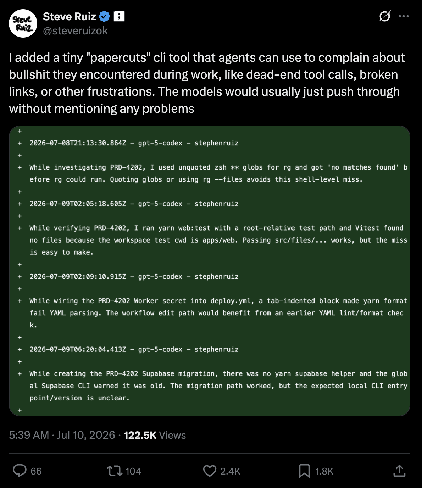

<picture>
  <source media="(prefers-color-scheme: dark)" srcset=".github/logo-dark.svg">
  <source media="(prefers-color-scheme: light)" srcset=".github/logo-light.svg">
  
</picture>

<p align="center">
  Automated friction logging for agents.
</p>

<br/>

<p align="center">
  <a href="https://www.npmjs.com/package/frog">
    <picture>
      <source media="(prefers-color-scheme: dark)" srcset="https://img.shields.io/npm/v/frog?colorA=21262d&colorB=21262d&style=flat">
      
    </picture>
  </a>
  <a href="https://github.com/wevm/frog/blob/main/LICENSE">
    <picture>
      <source media="(prefers-color-scheme: dark)" srcset="https://img.shields.io/npm/l/frog?colorA=21262d&colorB=21262d&style=flat">
      
    </picture>
  </a>
</p>

<p align="center">
  <a href="#problem">Problem</a> · <a href="#solution">Solution</a> · <a href="#quick-prompt">Quick Prompt</a> · <a href="#install">Install</a> · <a href="#workflow">Workflow</a> · <a href="#usage">Usage</a> · <a href="#action-only-mode">Action-only Mode</a> · <a href="#license">License</a>
</p>

## Problem

An agent hits friction constantly, and notices all of it. That makes it the best friction logger you have,
and the worst at keeping one: each workaround goes unrecorded, and the next agent starts from nothing.

Nobody who could fix the friction hears about it either. Keeping the log by hand does not work: you stop
noticing what to write, and nothing removes the entries you did write. The list goes stale, and a stale
list goes unread.



## Solution

Frog gives the agent somewhere to put it. Each entry is a directory in `.agents/friction-log/` holding the
write-up and whatever reproduces it, committed with the code and written the moment friction is hit. The
agent reads them before it starts guessing.

Each entry is then reported as an issue, so somebody owns it, and deleted once that issue closes, so the log
only ever holds what is still unresolved. Friction in a dependency can be reported to that project instead,
if it has opted in.

## Quick Prompt

Prompt your agent:

```txt
Run `npx frog init`, prompt me to choose between the GitHub App and Action-only automation, then set up
Frog in this project.
```

## Install

```bash
npm i -D frog
```

```bash
pnpm i -D frog
```

```bash
bun i -D frog
```

Then, once per repository:

```bash
frog init
```

Frog supports two automation methods. If an agent is doing the setup, it should prompt the user before
changing repository access or adding a workflow:

- Install the [Frog GitHub App](https://github.com/apps/frog-fm/installations/new) for pull-request
  comments, forks, and cross-repository reporting.
- Use the Action-only workflow below for same-repository automation without an external App write grant.

## Workflow

See a demonstration in [wevm/frog-demo](https://github.com/wevm/frog-demo), where an agent adding a
health endpoint hit a config loader that turns a missing environment variable into the string
`"undefined"`, and logged it on the way past.

| Step | What happens                                                                    | Example                                                       |
| ---- | ------------------------------------------------------------------------------- | ------------------------------------------------------------- |
| 1    | Agent hits friction while working and runs `frog log`                           | —                                                             |
| 2    | The entry commits alongside the change that provoked it                         | [`0de4ab6`](https://github.com/wevm/frog-demo/commit/0de4ab6) |
| 3    | Frog comments on the pull request, naming what it found                         | [#1](https://github.com/wevm/frog-demo/pull/1)                |
| 4    | Frog reports the entry as an issue and writes the `issue:` link onto the branch | [#2](https://github.com/wevm/frog-demo/issues/2)              |
| 5    | You fix the friction and close the issue                                        | [#3](https://github.com/wevm/frog-demo/pull/3)                |
| 6    | Frog opens a pull request deleting the resolved entry                           | [#4](https://github.com/wevm/frog-demo/pull/4)                |
| 7    | Merging leaves the log holding only what is still unresolved                    | [`e4ac13d`](https://github.com/wevm/frog-demo/commit/e4ac13d) |

<details>
<summary>Action-only workflow</summary>

Action-only uses the repository's workflow and `GITHUB_TOKEN`, without installing the Frog GitHub App:

| Step | What happens                                                                                                   | Example                                                                                                                             |
| ---- | -------------------------------------------------------------------------------------------------------------- | ----------------------------------------------------------------------------------------------------------------------------------- |
| 1    | Run `frog init`, choose Action-only, and add `.github/workflows/frog.yml`.                                     | [`5a3142b`](https://github.com/wevm/frog-demo-action/commit/5a3142b)                                                                |
| 2    | An agent hits friction and runs `frog log`; the report uses the repository's friction issue form.              | [`friction.md`](https://github.com/wevm/frog-demo-action/blob/5a3142b/.agents/friction-log/20260728085722-load-turns-a/friction.md) |
| 3    | Frog reports the friction as an issue and opens or updates one accumulating `frog/sync` pull request.          | [#1](https://github.com/wevm/frog-demo-action/issues/1) · [#2](https://github.com/wevm/frog-demo-action/pull/2)                     |
| 4    | A fix closes the issue.                                                                                        | [#3](https://github.com/wevm/frog-demo-action/pull/3)                                                                               |
| 5    | The issue event or next scheduled run updates the same `frog/sync` pull request to delete the resolved report. | [#2](https://github.com/wevm/frog-demo-action/pull/2)                                                                               |
| 6    | Merging leaves the log holding only unresolved reports.                                                        | [`900ea2c`](https://github.com/wevm/frog-demo-action/commit/900ea2c)                                                                |

</details>

## Usage

### Add Logs

Records one friction as an entry: a directory holding the write-up and anything needed to reproduce it.
Prompts for the details in a terminal, or takes them as flags.

`--publish` reports it as an issue immediately. Otherwise it stays pending until the next `frog publish`.

```sh
frog log
```

```
.agents/friction-log/20260725143012-pnpm-test-files/
  friction.md     the write-up
  artifacts/      optional, whatever reproduces it
```

### View Logs

Shows every unresolved entry: what it is, whether it has been reported, where it is targeted, and whether it
ships a reproduction. Exits 1 on an entry that fails to parse, so it doubles as a CI check.

```sh
frog list
```

### Skills and MCP

Teaches agents **when** to log, which is the part they cannot infer. The rule is _log when you worked around
something_; see [`SKILL.md`](./SKILL.md) for the full trigger.

`mcp add` exposes each command as a typed tool, so agents call Frog directly rather than composing shell.

```sh
frog skills add
frog mcp add
```

### Logging Upstream

Reports friction to another project instead of your own. A target is an npm package or an `owner/repo`,
and it has to have opted in: `targets` lists the ones your dependencies declare.

A package names its repository through the standard `repository` field, and consent is then read from that
repository's own default branch. So nothing a package says can send a report somewhere that has not itself
agreed to receive one.

Naming a target also scaffolds the entry from that project's GitHub issue form, so the report answers the
questions it actually asks rather than Frog's own. A project that names no form keeps Frog's sections.

```sh
frog targets
frog log --target viem
```

### Accept Inbound Logs

Every `frog init` adds `.github/ISSUE_TEMPLATE/friction.yml`, keeping human issues and Frog entries in
the same shape. Add `--library` to accept reports from projects that depend on this one.

```sh
frog init --library
```

## CLI Reference

```
frog — Automated friction logging for agents.

Usage: frog <command>

Commands:
  init     Create the friction log, config, and issue form.
  list     List entries with their state.
  log      Write a friction entry.
  publish  Report pending entries as GitHub issues.
  sync     Reconcile entries against issue state.
  targets  List dependencies that accept friction reports.

Integrations:
  completions  Generate shell completion script
  mcp          Register as MCP server (add, doctor)
  skills       Sync skill files to agents (add, list)

Global Options:
  --filter-output <keys>              Filter output by key paths (e.g. foo,bar.baz,a[0,3])
  --format <toon|json|yaml|md|jsonl>  Output format
  --full-output                       Show full output envelope
  --help                              Show help
  --llms, --llms-full                 Print LLM-readable manifest
  --mcp                               Start as MCP stdio server
  --schema                            Show JSON Schema for command
  --token-count                       Print token count of output (instead of output)
  --token-limit <n>                   Limit output to n tokens
  --token-offset <n>                  Skip first n tokens of output
  --version                           Show version
```

## Action-only Mode

`frog init` describes both methods without choosing one. For Action-only, create
`.github/workflows/frog.yml`:

```yaml
name: Frog
on:
  push:
  issues:
    types: [closed, reopened]
  workflow_dispatch:
  schedule:
    - cron: '0 0 * * *'

concurrency:
  group: frog
  cancel-in-progress: false

permissions: {}

jobs:
  frog:
    name: Frog
    if: github.event_name != 'push' || github.ref_name == github.event.repository.default_branch
    runs-on: ubuntu-latest
    permissions:
      contents: write
      issues: write
      pull-requests: write

    steps:
      - name: Clone repository
        uses: actions/checkout@v6
        with:
          persist-credentials: false
          ref: ${{ github.event.repository.default_branch }}

      - name: Report and reconcile friction
        uses: wevm/frog/action@v1
```

The workflow uses the repository's own `GITHUB_TOKEN` to report pending entries, reconcile issue state,
and push the resulting commits. Frog is installed under `RUNNER_TEMP`, isolated from the repository's
dependencies.

### GitHub App or Action-only?

Choose the **GitHub App** for pull-request feedback, forks, cross-repository reporting, or durable event
processing. Choose **Action-only** when same-repository automation and avoiding an external write grant
matter most. Choose one method per repository; concurrent App and Action-only runs can create duplicate
issues.

| Area           | GitHub App                                                                      | Action-only                                                                 |
| -------------- | ------------------------------------------------------------------------------- | --------------------------------------------------------------------------- |
| Trust          | Grants the Frog App access to selected repositories.                            | Uses this repository's `GITHUB_TOKEN`; no third-party App installation.     |
| Scope          | Cross-repository reporting and reconciliation where installed and allowed.      | Same repository only; `target:` entries stay deferred.                      |
| Pull requests  | Reports during the pull request and posts or updates one comment.               | Reports after merge, without commenting on the author's pull request.       |
| Forks          | Installation credentials work independently of the fork token.                  | Cannot safely report from fork pull requests.                               |
| Reconciliation | Webhooks react immediately, with durable retries and serialization.             | Workflows plus a daily sweep; issue edits wait for the next run.            |
| Delivery       | Commits through GitHub's API, directly or through an accumulating pull request. | Commits locally, then pushes directly or updates `frog/sync`.               |
| Setup          | Needs the App installed with its requested repository permissions.              | Needs workflow write permissions and Actions-created pull requests enabled. |
| Operations     | Requires the Worker, queues, secrets, and App installation.                     | Uses Actions minutes and installs Frog from npm; no service to run.         |

Before using the default pull-request mode, enable **Allow GitHub Actions to create and approve pull
requests** under **Settings > Actions > General**. Pull-request checks created by `GITHUB_TOKEN` wait
for a user with write access to approve each workflow run. Push-only workflows do not run; pass a
personal access token or App token as `token` when they are required.

This mode deliberately has a smaller boundary than the App:

- A protected default branch needs a human to merge `frog/sync`. Complete runs force-update the branch;
  deferrals preserve the existing pull request. Do not hand-edit it.
- `contents: write` is required to push and keep dedupe on the label-filtered issue index.
- `@v1` moves with compatible releases. Pin both a full action commit SHA and an exact `version` input
  to fix Frog itself; npm still resolves the published package's dependency ranges at install time.
- Never run it on `pull_request`. Fork tokens are read-only, and pull-request config is untrusted.
  `pull_request_target` is unsafe for the same reason.
- One malformed `friction.md` fails the run because the log cannot be read partially.

## License

[MIT](./LICENSE)
